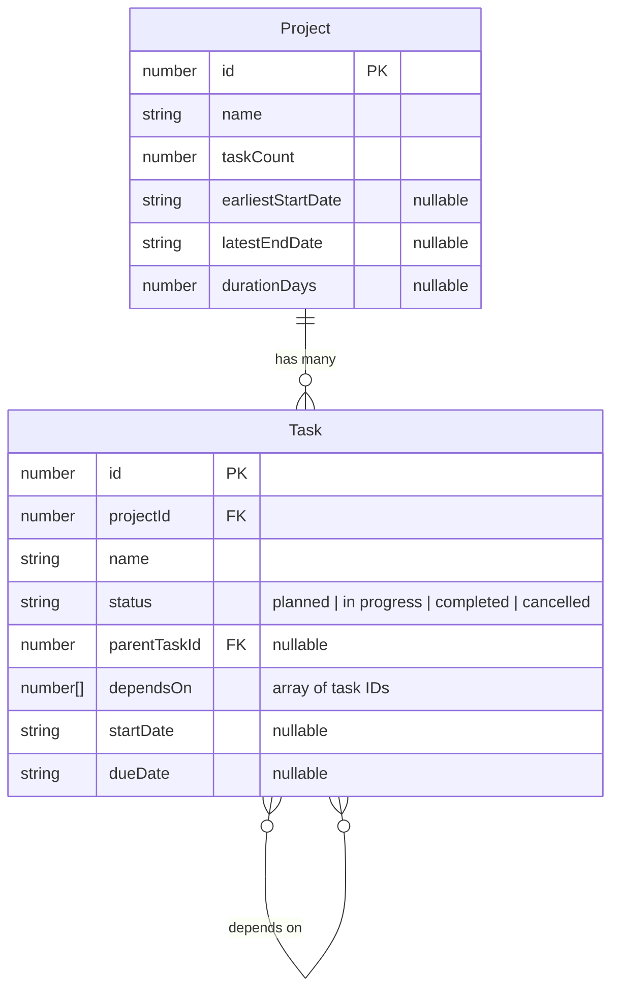

# Interview Problem (Frontend): Project Management

## Context

- Our company goal is to develop mineral extraction projects more efficiently than our peers without compromising on quality and safety.
- Our team of process engineers and project developers uses a combination of industry standard software and in-house custom software designed to integrate with, streamline, and fill in the gaps of standard software.
- To that end, one of the many things we find ourselves doing is integrating different project management tools, and providing project schedule insights which are otherwise unavailable.

### Common User Problems

- "What is task X connected to? If task X is delayed, what other tasks will be delayed?"
- "What's supposed to happen in the next two weeks?"
  - _related: What's the weather looking like for those two weeks? I'll need to reschedule concrete pouring if it will rain..._
- "What are all the tasks which lead up to task Y?"

## Goals

We're going to engage in an exercise of rapid prototyping against a simple management service with the following goals:

1. Develop views (1) to list projects and (2) view the listing of tasks for a chosen project
2. Refine your initial app to address some user needs.
   - _Note: Today we're more interested in viewing complex data in a variety of ways than in creating, modifying, or deleting it_

We're hoping to see you demonstrate experience with web application design and software engineering by sharing your thought process.

## Setup

If you haven't done so yet, please initialize a project for a frontend framework of your choice. _(Typescript is preferred but other languages are permitted.)_

## Instructions

- Work with tools of your choice and share your full screen during the interview
  - _Note: We'll record the session for memory's sake and for improving our process._
- Before ending the interview, zip up the files and share them with your interviewer via link. Do not send them as an email attachment.
- This interview is fully open book, with use of AI coding tools fully encouraged as long as you show your process.
- You may be expected to explain any of the AI code you accept.

## Task Management API

- Available via ngrok at an address provided by your interviewer
  - API will be available via ngrok at an address such as like `https://{TUNNEL_ID}.ngrok-free.app`
  - API docs will be available at `https://{TUNNEL_ID}.ngrok-free.app/api-docs/swagger`
  - JSON formatted API docs will be available at `https://{TUNNEL_ID}.ngrok-free.app/api-docs`
- The task management service is preloaded with example data
- No authentication is needed

### Data Model

The task management service uses the following entity structure:

**Key Relationships:**

- A `Project` can have many `Task`s
- A `Task` belongs to one `Project` (via `projectId`)
- A `Task` can have a parent `Task` (via `parentTaskId`) for hierarchical organization
- A `Task` can depend on multiple other `Task`s (via `dependsOn` array) for dependency tracking

## Optional Resources

You don't need to engage with the following links in order to successfully complete this interview, but you may find them useful.

- [Gantt chart](https://en.wikipedia.org/wiki/Gantt_chart)
  - One of many project management visualizations our users are familiar with.
- [Critical Path Method](https://en.wikipedia.org/wiki/Critical_path_method)
  - An approach to scheduling or analyzing complex projects with dependencies.
- [Open Meteo](https://open-meteo.com/)
  - A free weather API